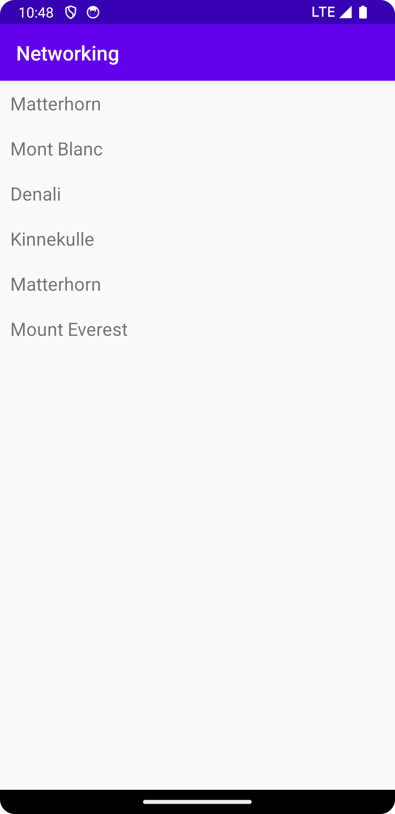

# Rapport

First a recyclerview was added in the activity_main. Then I created an arraylist<mountain> that will store the mountains data. Then I created the class
recyclerviewadapter and created the adapter and the viewholder. This is then added in main acitivty as a member variable to populate the recycleview with 
data. I created a for-loop that iterates through the list of mountains and then creates a new recyclerviewitem for each of the names using 
mountain.getName(), after the for-loop adapter.notifyDataSetChanged(); is used to update the recyclerview with the new data. Down below is a code snippet
representing this.

    for (Mountain mountain : listOfMountains) {
    items.add(new RecyclerViewItem(mountain.getName()));

        }

        adapter.notifyDataSetChanged();

    }   

Then at last I created a GetJson method which is responsible for fetching the data from the JSON_URL and FILE. 

Down below is a screenshot attached showing the screen when the program is executed.

Läs gärna:

- Boulos, M.N.K., Warren, J., Gong, J. & Yue, P. (2010) Web GIS in practice VIII: HTML5 and the canvas element for interactive online mapping. International journal of health geographics 9, 14. Shin, Y. &
- Wunsche, B.C. (2013) A smartphone-based golf simulation exercise game for supporting arthritis patients. 2013 28th International Conference of Image and Vision Computing New Zealand (IVCNZ), IEEE, pp. 459–464.
- Wohlin, C., Runeson, P., Höst, M., Ohlsson, M.C., Regnell, B., Wesslén, A. (2012) Experimentation in Software Engineering, Berlin, Heidelberg: Springer Berlin Heidelberg.
